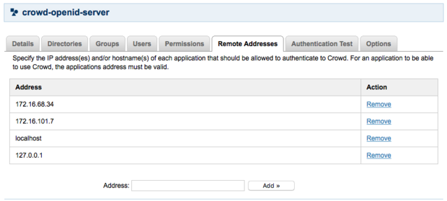

# Crowd LDAP Server

Implementation of an LDAP server that delegates authentication to an Atlassian Crowd installation
using the Crowd REST API. 

This service allows your favourite SSO authentication source to be used from many legacy devices, appliances and systems.

The LDAP implementation is based on the Apache Directory Server v1.5.7,  which is distributed under the Apache v2.0 License.

## Reference

* fork from [dwimberger/crowd-ldap-server](https://github.com/dwimberger/crowd-ldap-server)
* used for [Gerrit](http://wiki.li3huo.com/Gerrit) LDAP

## Build

	mvn package

## Configuration

### Crowd Server

### Crowd LDAP Server
vi etc/crowd.properties

	#Crowd Server Configuration
	session.lastvalidation=session.lastvalidation
	session.isauthenticated=session.isauthenticated
	application.password=<crowd application password>
	application.name=crowd-openid-server
	session.validationinterval=0
	crowd.server.url=http://127.0.0.1/crowd/services/
	session.tokenkey=session.tokenkey
	application.login.url=http://127.0.0.1/crowd/console/

## Run

	./run

## Test

	➜  crowd-ldap-server git:(master) ldapsearch -x -D 'uid=jira,ou=users,dc=crowd' -W -H ldap://localhost:10389 -b ou=users,dc=crowd uid=jira
	ldap_initialize( ldap://localhost:10389/??base )
	Enter LDAP Password: 
	filter: uid=jira
	requesting: All userApplication attributes
	# extended LDIF
	#
	# LDAPv3
	# base <ou=users,dc=crowd> with scope subtree
	# filter: uid=jira
	# requesting: ALL
	#

	# jira, users, crowd
	dn: dn=jira,ou=users,dc=crowd
	uid: jira
	sn: jira
	mail: jira@...

	➜  crowd-ldap-server git:(master) ✗ ldapsearch -x -D "uid=jira,ou=users,dc=crowd" -W -H ldap://localhost:10389 -b 'ou=users,dc=crowd' '(uid=liyan)' uid displayName mail cn
	Enter LDAP Password: 
	# extended LDIF
	#
	# LDAPv3
	# base <ou=users,dc=crowd> with scope subtree
	# filter: (uid=liyan)
	# requesting: uid displayName mail cn 
	#

	# liyan, users, crowd
	dn: dn=liyan,ou=users,dc=crowd
	uid: liyan
	mail: liyan@facebook.com
	cn:: 5p2OIOeEsQ==

	# search result
	search: 2
	result: 0 Success

	# numResponses: 2
	# numEntries: 1
